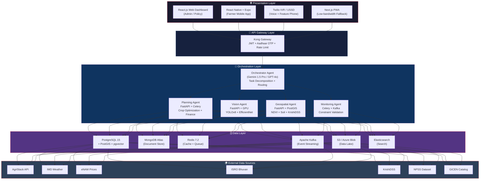
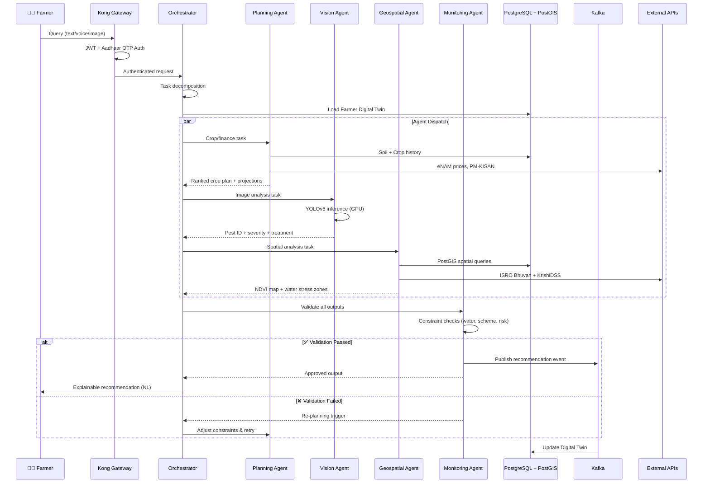
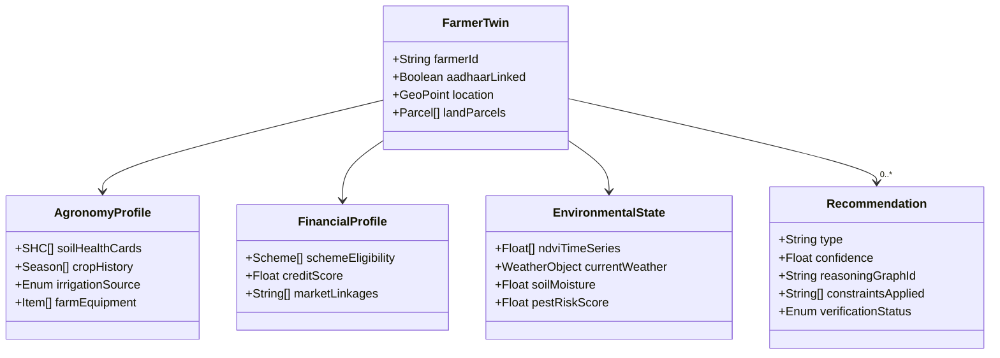

# 🏗️ SasyaAI — Architecture (Derived from `.gitignore`)

> Every section in the [.gitignore](./.gitignore) maps to a logical layer in the architecture below.

---

## 1. High-Level System Topology



---

## 2. Project Directory Tree (from `.gitignore`)

The `.gitignore` implicitly defines the full project structure:

```
SasyaAI/
│
├── 📄 .gitignore                  ← Architecture map
├── 📄 README.md                   ← Project overview
├── 📄 AgriTwin_AI_Proposal.docx   ← Hackathon proposal
│
├── 📁 Docs/                       ← Design documentation (git-ignored)
│   ├── ARCHITECTURE.md
│   ├── TECH_STACK.md
│   ├── MASTER_PLAN.md
│   ├── REQUIREMENTS.md
│   ├── DEPLOYMENT.md
│   ├── SECURITY.md
│   ├── PERMISSIONS.md
│   ├── HOW_TO_USE.md
│   └── AI_IDE_SETUP.md
│
├── 📁 services/                   ← Backend microservices (Python/FastAPI)
│   ├── orchestrator/              ← LLM core — task decomposition + routing
│   ├── planning_agent/            ← Crop/finance constraint optimization
│   ├── vision_agent/              ← YOLOv8 pest/disease detection (GPU)
│   ├── geospatial_agent/          ← PostGIS + GDAL spatial analysis
│   ├── monitoring_agent/          ← Kafka consumer + constraint validator
│   └── shared/                    ← Common schemas, utils, configs
│
├── 📁 models/                     ← ML model artifacts (git-ignored)
│   ├── yolov8_npss/               ← Fine-tuned YOLOv8 weights
│   ├── efficientnet_b4/           ← Disease severity grading
│   ├── lstm_yield/                ← Time-series yield forecasting
│   ├── tft_weather/               ← Temporal Fusion Transformer
│   ├── xgboost_scheme/            ← Scheme eligibility scoring
│   ├── whisper_indic/             ← Multilingual ASR (10+ languages)
│   ├── coqui_tts/                 ← Text-to-speech for IVR
│   ├── embeddings/                ← sentence-transformers + FAISS
│   └── llm_gguf/                  ← Quantized Llama 3.2 for edge
│
├── 📁 data/                       ← All datasets (git-ignored)
│   ├── raw/
│   │   ├── agristack/             ← Farmer registry + land records
│   │   ├── soil_health/           ← 230M+ Soil Health Cards
│   │   ├── npss_images/           ← ~50K labeled pest images
│   │   ├── weather_imd/           ← IMD NetCDF/CSV archives
│   │   ├── enam_prices/           ← Market price snapshots
│   │   ├── satellite/             ← Sentinel-2 / ResourceSat GeoTIFFs
│   │   └── gicen/                 ← Telangana shapefiles, soil moisture
│   ├── processed/                 ← Feature-engineered datasets
│   ├── embeddings/                ← FAISS vector indices
│   └── cache/                     ← Redis dumps, temp processing
│
├── 📁 frontend/                   ← Client applications
│   ├── web/                       ← React.js + Tailwind (admin dashboard)
│   ├── mobile/                    ← React Native + Expo (farmer app)
│   └── ivr/                       ← Twilio VXML voice configs
│
├── 📁 infra/                      ← Infrastructure as Code
│   ├── docker/                    ← Dockerfiles per service
│   ├── helm/sasyaai/              ← Helm charts (prod + staging values)
│   ├── terraform/                 ← AWS/Azure IaC (EKS, RDS, MSK)
│   ├── k8s/                       ← Raw K8s manifests
│   └── monitoring/                ← Prometheus rules, Grafana dashboards
│
├── 📁 tests/                      ← Testing pyramid
│   ├── unit/                      ← Per-service unit tests
│   ├── integration/               ← Cross-service API tests
│   ├── e2e/                       ← Cypress / Playwright
│   └── fixtures/                  ← Mock data (farmer profiles, images)
│
├── 📁 notebooks/                  ← Jupyter experiments
│   ├── eda/                       ← Exploratory data analysis
│   ├── model_training/            ← Training experiments
│   └── prototyping/               ← Agent behavior prototyping
│
└── 📁 secrets/                    ← Credentials (git-ignored, Vault-managed)
```

---

## 3. Multi-Agent Data Flow



---

## 4. Deployment Pipeline

```mermaid
flowchart LR
    subgraph DEV["💻 Developer"]
        CODE["Code Push"]
    end

    subgraph CI["⚙️ CI/CD"]
        GHA["GitHub Actions"]
        LINT["Lint + Test"]
        BUILD["Docker Build"]
        ECR["Push to ECR"]
    end

    subgraph CD["🚀 GitOps"]
        ARGO["ArgoCD"]
        HELM["Helm Upgrade"]
    end

    subgraph K8S["☸️ Kubernetes (EKS/AKS)"]
        direction TB
        ING["NGINX Ingress"]
        ISTIO["Istio Service Mesh"]
        PODS["Microservice Pods"]
        GPU["GPU Nodes (Vision)"]
    end

    subgraph MANAGED["☁️ Managed Services"]
        RDS["RDS PostgreSQL"]
        ELAST["ElastiCache Redis"]
        MSK["Amazon MSK Kafka"]
        BLOB["S3 Data Lake"]
    end

    subgraph OBS["📊 Observability"]
        PROM["Prometheus"]
        GRAF["Grafana"]
        JAEG["Jaeger Tracing"]
        OTEL["OpenTelemetry"]
    end

    CODE --> GHA --> LINT --> BUILD --> ECR
    ECR --> ARGO --> HELM
    HELM --> K8S
    K8S --> MANAGED
    K8S --> OBS

    style DEV fill:#1a1a2e,stroke:#e94560,color:#fff
    style CI fill:#16213e,stroke:#0f3460,color:#fff
    style CD fill:#0f3460,stroke:#533483,color:#fff
    style K8S fill:#533483,stroke:#e94560,color:#fff
    style MANAGED fill:#2d4059,stroke:#ea5455,color:#fff
    style OBS fill:#1b1b2f,stroke:#e94560,color:#fff
```



---

## 5. Digital Twin Data Model



---

## 6. `.gitignore` ↔ Architecture Layer Mapping

| `.gitignore` Section | Architecture Layer | Key Technologies |
|---|---|---|
| `Docs/` | Documentation | ARCHITECTURE, TECH_STACK, MASTER_PLAN, REQUIREMENTS |
| `__pycache__/`, `*.py[cod]`, `venv/` | Backend Services | Python 3.11, FastAPI, Celery |
| `*.pt`, `*.onnx`, `models/` | AI/ML Models | YOLOv8, EfficientNet, LSTM, XGBoost, Whisper, FAISS |
| `data/`, `*.csv`, `*.geojson`, `*.tif` | Data Lake + Spatial | AgriStack, SHC, NPSS, IMD, GICEN, Satellite |
| `node_modules/`, `.next/`, `.expo/` | Frontend / Clients | React.js, React Native, Next.js, Twilio IVR |
| `*.tfstate`, `.terraform/` | Infrastructure | Terraform, Docker, Helm, Kubernetes |
| `*.pem`, `*.key`, `secrets/` | Security / Secrets | HashiCorp Vault, JWT, Aadhaar e-KYC |
| `.pytest_cache/`, `coverage/` | Testing | pytest, Cypress, Playwright |
| `.ipynb_checkpoints/` | Experimentation | Jupyter notebooks, EDA, model training |
| `.vscode/`, `.idea/` | Developer Tooling | IDE configs |
| `.DS_Store`, `Thumbs.db` | OS Artifacts | macOS / Windows system files |
