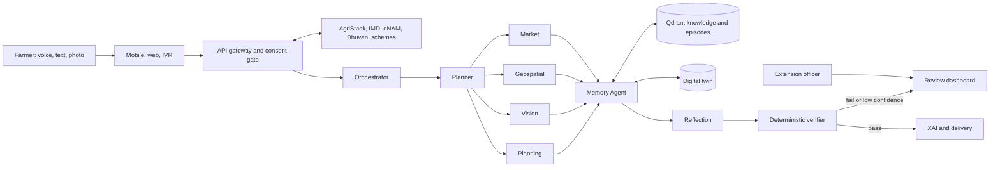
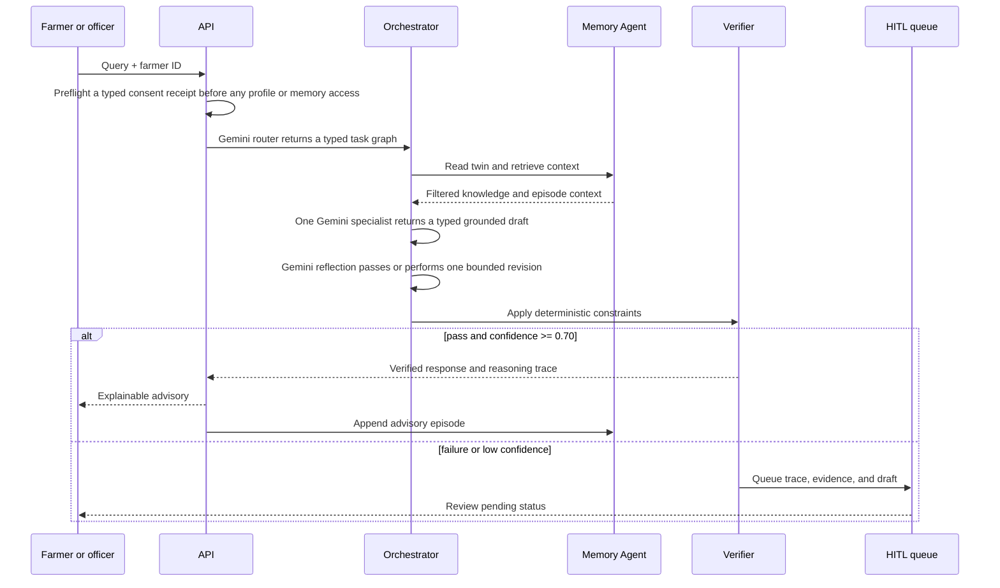

# SasyaAI Architecture

## 1. Architecture principle

SasyaAI has two deliberately separate shapes:

- **Demonstrator:** a deterministic FastAPI workflow backed by checked-in synthetic data. It proves contracts, consent preflight, decision flow, verification, memory ownership, and HITL without claiming live-data or model capability.
- **Production platform:** a typed provider-backed graph connected to consent-gated government, weather, market, PostgreSQL, and Qdrant sources.

The demonstrator is an architectural thin slice of the production target, not a mock that bypasses safety controls.

## 2. Current implementation snapshot

The current repository already contains a working demo implementation rather than a stubbed prototype. The backend entrypoint in [backend/app/main.py](../backend/app/main.py) wires the FastAPI routes for auth, farmer onboarding, advisory queries, image upload, feedback, HITL review, runtime health, audit, and deletion requests. The dashboard in [frontend/src/App.tsx](../frontend/src/App.tsx) exposes role-scoped views for farmers, officers, and admins, while [backend/app/services/advisory.py](../backend/app/services/advisory.py) and [backend/app/services/security.py](../backend/app/services/security.py) enforce consent preflight, prompt-injection guardrails, deterministic verification, and scoped memory access.

The production path remains explicitly guarded: it is available in code and configuration, but the local demo runtime is the verified default for review and demonstration.

## 3. Logical system view



## 4. Demonstrator components

| Component | Current implementation | Production replacement or extension |
|---|---|---|
| API | `backend/app/main.py` FastAPI routes | Gateway, OAuth2/JWT, rate limiting, audit middleware |
| Consent gate | Typed, fail-closed synthetic fixture adapter with purpose, scope, lifecycle, and provenance checks | Authenticated consent receipt verifier and revocation/cleanup workflow |
| Orchestration | Deterministic `AdvisoryService` with the production response contract | Implemented typed Root Manager with Gemini router, specialist, and reflection calls |
| Agent tools | Seed JSON and predictable context | AgriStack, IMD, eNAM, Bhuvan, CGWB, scheme, and ML adapters |
| Knowledge retrieval | Lexical ranking over 105 synthetic records | Implemented Qdrant vector retrieval with mandatory payload filters and governed ingest |
| Digital twin | 18 synthetic JSON profiles | Implemented PostgreSQL state; PostGIS/encryption remain deployment gates |
| Episodic memory | Runtime JSON under ignored `var/` | Qdrant `farmer_memory`, retention and export/deletion controls |
| Verification | Deterministic demo water, cost, weather, scheme, and dose checks | Versioned rules engine, authoritative data freshness and audit evidence |
| HITL | Runtime JSON review queue | Implemented PostgreSQL queue, row-locked decisions, and role-protected operations UI |

## 5. Mandatory request flow



## 6. Data ownership and boundaries

Only the Memory Agent boundary may persist twin state or advisory episodes. Other agents are stateless and return typed outputs. This makes retries safe and prevents a failed draft from changing farmer state.

| Store | Owner | Data | Demo | Production |
|---|---|---|---|---|
| Working memory | Root/orchestrator | Current task and conversation | In-process request | Session store with expiry |
| Digital twin | Memory Agent | Identity, agronomy, finance, environment, risk | Synthetic JSON | PostgreSQL 15 + PostGIS, versioned |
| Semantic memory | Memory Agent | Crop, pest, and scheme facts | Seed JSON | Qdrant collections and governed ingest |
| Episodic memory | Memory Agent | Advice, outcomes, review state | Ignored runtime JSON | Qdrant filtered by `farmer_id` |
| Audit log | Platform security boundary | Access, decisions, verification evidence | Application trace | Immutable, access-controlled log |

## 7. Data model and collection contracts

`FarmerTwin` is keyed by a stable AgriStack farmer identifier and contains:

- identity and consent references (never a stored Aadhaar number);
- parcel and agronomy profile, including crop history and soil health;
- financial constraints, eligible schemes, and market linkages;
- environment state: weather, NDVI, soil moisture, groundwater/risk indicators;
- active and historical recommendations with verification state.

The first Qdrant collections are `crop_kb`, `pest_kb`, `scheme_kb`, and `farmer_memory`. Retrieval must combine vector similarity with mandatory payload filters, especially `farmer_id` for episodes and state/season/crop for policy or agronomy facts.

## 8. Service interfaces

Production services communicate through typed HTTP or event contracts. A task must include `request_id`, `farmer_id`, source, timestamp, data freshness, consent context, confidence, and verification requirement. Avoid free-text inter-agent control messages.

| Interface | Pattern | Purpose |
|---|---|---|
| Query API | Synchronous REST | Farmer question to verified response or queued review |
| Tool adapter | Synchronous typed call | Read an external source with timeout and fallback metadata |
| Twin update | Versioned command/event | Persist an authorised state change |
| Alert pipeline | Asynchronous Kafka event | Weather, market, or monitoring trigger |
| Review workflow | Durable queue plus REST | Officer approve, edit, reject, and audit |

## 9. Security architecture

1. Verify consent and role before every farmer-data access. The local adapter is fixture-only and fails closed; it is not an authentication or live-consent substitute.
2. Enforce least privilege and typed service-to-service identity.
3. Minimise PII: no Aadhaar storage, hashed mobile identifiers, rounded location when exact geometry is unnecessary.
4. Encrypt sensitive data at rest and in transit; keep production PII in Indian regions.
5. Sanitize untrusted content and never allow prompts to override verification rules.
6. Preserve an audit record of data access, advice, verifier outcomes, and human decisions.
7. Treat failed deterministic safety checks as non-overridable in the demonstrator; a reviewer may reject the case and start a new verified request, but cannot approve or edit around the failure.

The full consent, threat, RBAC, incident, and retention specifications are in [SECURITY.md](SECURITY.md).

## 10. Deployment progression

| Stage | Runtime | Data | Operational minimum |
|---|---|---|---|
| Local demo | Uvicorn or Docker Compose | Synthetic seed JSON, optional local Qdrant | Test suite, no real credentials |
| Integration | Containerized staging | Qdrant + PostgreSQL, approved AgriStack gateway | Secret store, provider contract tests, OTLP traces |
| Pilot | Indian-cloud staging | Governed pilot records | RBAC, auditing, monitoring, backup/restore drills |
| Production | Kubernetes with autoscaling | Managed encrypted stores | CI/CD gates, observability, incident response, DR |

## 11. Repository boundaries

```text
backend/app/       API, domain contracts, workflow, and adapters
data/seed/         only synthetic, reviewed demonstration data
frontend/          extension-officer dashboard scaffold
scripts/           deterministic evaluation-corpus tooling
ml/                model interfaces, datasets policy, evaluation plans
infra/             deployment and observability assets
Docs/              canonical engineering and product documentation
tests/             executable proof of intended behaviour
```

`services/` remains as the earlier package scaffold for compatibility with the initial sprint notes; new application code belongs in `backend/app/`. Consolidating the older scaffold is a planned refactor once downstream consumers have migrated.
