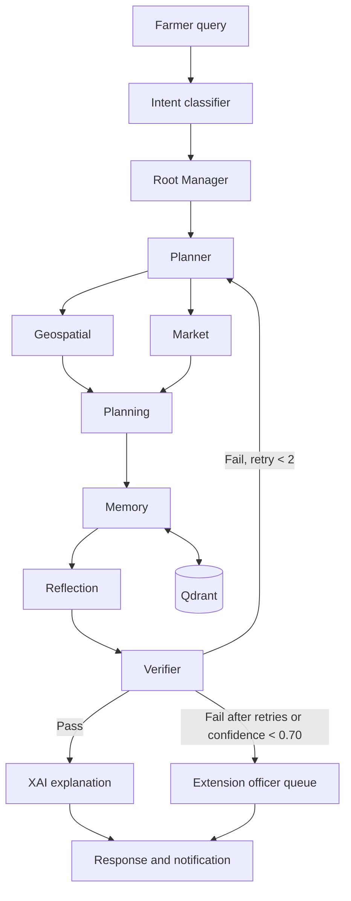

# SasyaAI Master Plan

> **Canonical delivery plan.** This document turns the product, architecture, security, sandbox, and Cursor sprint notes into one execution sequence. It distinguishes the hackathon demonstrator from the production platform so that a fast demo does not become an accidental production design.

## 1. Purpose and success outcome

SasyaAI gives an Indian farmer a trustworthy, personalised agricultural advisory experience built around a continuously updated digital twin. It must combine farm context, weather, market data, crop and scheme knowledge, and human review into recommendations that are practical, explainable, and safe.

The immediate goal is a live, agent-first demo that proves five things:

1. A farmer query is decomposed and routed through a visible multi-agent workflow.
2. Advice is grounded in retrieved knowledge and the farmer's prior context.
3. Deterministic checks prevent unsafe or ineligible recommendations.
4. Low-confidence cases are routed to an extension officer instead of auto-delivered.
5. The system can explain the recommendation in plain language and preserve an auditable memory of it.

The production goal is the broader platform described in the PRD: crop planning, pest diagnosis, geospatial insight, market and scheme guidance, proactive monitoring, multilingual/voice delivery, and an offline-capable farmer experience.

## 2. Scope, decisions, and current baseline

### 2.1 Delivery strategy

| Area | Demonstrator scope | Production direction |
|---|---|---|
| Agent execution | Lyzr Studio/SuperFlow with a small, visible graph | Typed code-first agent hierarchy (Google ADK evaluated alongside Lyzr lifecycle tooling) |
| Persistent memory | Qdrant with four seeded collections; JSON farmer twins | Qdrant plus versioned PostgreSQL/PostGIS digital twins |
| External data | Deterministic mocks and synthetic AgriStack profiles | Consent-gated AgriStack, IMD, eNAM, KrishiDSS, Bhuvan, CGWB, and scheme integrations |
| Planning | Rule-based or simplified ranking | OR-Tools feasibility solver with risk-adjusted, Pareto-ranked crop plans |
| User experience | API, embedded chat, and a minimal HITL page | React Native farmer app, web dashboard, voice/IVR, and offline mode |
| Hosting | Qdrant Cloud or local Docker, Lyzr Cloud, small FastAPI service | India-resident Kubernetes deployment with CI/CD, observability, and managed data stores |

The demonstrator intentionally does **not** claim production readiness. It uses synthetic data, mocked integrations, and a narrow set of intents to validate the product's decision flow.

### 2.2 Current repository baseline

The repository currently contains the planning documentation, a Qdrant Docker service, environment-variable template, dependency list, and initial Python package/configuration files. The FastAPI entry point, seeded data, Qdrant initialization, tools, agent definitions, API routes, tests, and HITL user interface still need to be implemented.

### 2.3 Non-negotiable system rules

- Obtain and verify consent before accessing farmer data.
- Only the Memory Agent may write a digital twin or Qdrant record.
- Every consequential recommendation must pass Reflection, deterministic Verification, and confidence scoring before delivery.
- A verifier failure may be re-planned at most twice; it then goes to Human-in-the-Loop (HITL).
- A confidence score below `0.70` goes to HITL rather than being auto-delivered.
- Every external tool needs a fallback source or an explicit degraded-confidence response.
- Aadhaar numbers are never stored; production PII is minimized, encrypted, access-controlled, and kept in India.

## 3. Demonstrator definition

### 3.1 Supported intents

Implement three intent routes and show at least two live:

| Intent | Farmer example | Demonstrates |
|---|---|---|
| `crop_plan_request` | “Should I switch from cotton to soybean?” | Parallel context gathering, crop ranking, memory, reflection, verification, XAI |
| `diagnose` | “What is affecting this crop?” | Pest knowledge retrieval, treatment safety gate, low-confidence escalation |
| `scheme_query` | “Am I eligible for this scheme?” | Filtered scheme retrieval and eligibility validation |

### 3.2 Agent workflow

The demo configures eight core Lyzr agents. XAI rendering, notification delivery, and the HITL queue are final workflow stages rather than additional reasoning agents.

| Component | Responsibility | Demo implementation |
|---|---|---|
| Root Manager | Own the session, consent preflight, and delegation | Lyzr manager agent |
| Planner | Produce the ordered/parallel task graph | Structured JSON output |
| Geospatial | Supply NDVI, weather, and water context | Deterministic district/parcel mock |
| Market | Supply price trend and volatility | Seeded eNAM-like snapshot |
| Planning | Rank crop options and form a recommendation | Simplified feasibility-aware scorer |
| Memory | Own all twin and Qdrant reads/writes | Qdrant tools plus JSON twin mock |
| Reflection | Check relevance, completeness, units, and tone | Structured pass/revise critique |
| Verifier | Enforce hard safety and eligibility rules | Deterministic Python checks |

### 3.3 API and visible outputs

| Route | Purpose |
|---|---|
| `POST /api/v1/query` | Run the Lyzr workflow or local fallback and return the structured response |
| `POST /api/v1/memory/search` | Debug retrieval for the demo |
| `GET /api/v1/farmers/{farmer_id}` | Inspect a synthetic farmer twin |
| `POST /api/v1/hitl/approve` | Approve, edit, or reject a queued recommendation |

The final response should expose the recommendation, evidence/retrieval summary, constraint results, confidence, farmer-friendly explanation, and an auditable execution trace. Do not expose secrets or raw PII in that trace.

## 4. Data and memory plan

### 4.1 Demo data

Seed three synthetic farmer profiles:

- `AGR_MH_001234`
- `AGR_TG_005678`
- `AGR_KA_009012`

Seed crop, pest, and scheme knowledge with enough records to make retrieval meaningful (target: roughly 50–100 curated items across the knowledge bases). All demo data must be synthetic or otherwise cleared for use.

### 4.2 Qdrant collections

| Collection | Purpose | Essential payload filters |
|---|---|---|
| `crop_kb` | Agronomy, crop suitability, soil and water guidance | `crop`, `region`, `soil_type` |
| `pest_kb` | Pest/disease facts and CIB-approved treatment protocols | `crop`, `pest_name`, `region`, `severity_band` |
| `scheme_kb` | Scheme rules and deadlines | `scheme_name`, `state`, `eligibility_json`, `deadline` |
| `farmer_memory` | Past advisory episodes and observed outcomes | `farmer_id`, `event_type`, `crop`, `season`, `timestamp` |

Use the configured multilingual MiniLM embedding model for the sprint. Re-evaluate a larger multilingual model before broad language rollout. All searches must combine semantic similarity with payload filters; `farmer_memory` queries must always filter by `farmer_id`.

The production design later adds weather and market history collections, a durable PostgreSQL/PostGIS twin, versioning, retention controls, and data-subject export/deletion workflows.

### 4.3 Digital twin lifecycle

The canonical twin contains identity, agronomy, financial, environmental, risk, active recommendations, and history. In production, events from weather, market, sensor, and agent outputs refresh relevant fields within 15 minutes. The demo keeps this model in JSON while retaining the same field ownership and write boundary.

## 5. Tools and verification

### 5.1 Mock tool layer

Build deterministic implementations before connecting live services:

| Tool | Demo data source | Production source |
|---|---|---|
| `agristack_farmer_lookup` | Seeded farmer JSON | AgriStack Farmer Data API |
| `agristack_consent_check` | Synthetic consent state | AgriStack Consent API |
| `imd_weather` / `ndvi_lookup` | Static, district/parcel fixtures | IMD and Bhuvan/KrishiDSS |
| `enam_price_feed` | Versioned price snapshot | eNAM API |
| `scheme_eligibility_check` | Filtered scheme knowledge/rules | Authoritative scheme services and curated KB |
| `qdrant_search` / `qdrant_upsert` | Qdrant | Qdrant |
| `twin_read` / `twin_write` | JSON files | PostgreSQL/PostGIS |

Keep the tool interface typed so mocks can be replaced without changing agent prompts or workflow contracts.

### 5.2 Required verifier checks

| Check | Rule | Result on violation |
|---|---|---|
| Water budget | Recommended irrigation must not exceed the twin's available budget | Re-plan with a tighter constraint |
| Financial feasibility | Input cost must not exceed budget plus eligible credit | Re-rank and identify the gap |
| Pesticide safety | Dose must not exceed the CIB-approved crop/pest maximum | Hard block; never auto-deliver |
| Scheme eligibility | Claim must satisfy current scheme rule filters | Re-check or refresh the rule source |
| Weather safety | Suppress non-urgent advice during active cyclone/frost-style warning | Send safety alert or HITL |

Reflection is different from verification: it checks whether the answer is useful, complete, correctly toned, and has required units; it does not replace deterministic safety checks.

## 6. One-day sprint execution plan

| Block | Time | Deliverables | Completion check |
|---|---:|---|---|
| Foundation | Hours 0–2 | Environment configured, Qdrant running, seed file schema, service directories | A local Qdrant instance is reachable and no secrets are committed |
| Memory and data | Hours 2–3 | Four collections, seed script, farmer twins, Memory Agent tools | Filtered retrieval and one guarded write succeed |
| Agent configuration | Hours 3–5 | Eight agents and crop-plan SuperFlow | Each agent can be invoked with a test input |
| Tools and API | Hours 5–7 | Mock tools, FastAPI routes, Lyzr proxy/local fallback | `POST /query` produces a structured crop-plan result |
| Safety and HITL | Hours 7–9 | Reflection format, verifier rules, HITL queue/page | An over-limit pesticide dose is blocked; low confidence is queued |
| Deploy and rehearse | Hours 9–12 | Hosted endpoint, collections visible, six-minute script | Full demo completes in under 20 seconds end-to-end |

### Sprint acceptance criteria

- The crop-plan path completes in under 20 seconds.
- Qdrant returns relevant knowledge and farmer-specific history.
- The verifier visibly blocks an intentionally unsafe pesticide dosage.
- Low-confidence diagnosis or failed verification reaches HITL.
- A final Marathi or Hindi explanation cites the relevant farm/market/water evidence.
- A public or locally hosted demo endpoint returns a traceable structured response.

## 7. Product roadmap after the sprint

| Phase | Horizon | Focus and exit criteria |
|---|---|---|
| 0 — Harden the foundation | Weeks 1–4 | Replace JSON twin with PostgreSQL/PostGIS, complete AgriStack sandbox checklist, add tests, audit logs, consent records, and CI |
| 1 — Agent MVP | Months 2–3 | Real planner, initial vision model, production-style tool adapters, Hindi experience, fully tested verifier and HITL flow |
| 2 — Full product | Months 4–6 | Geospatial pipeline, Reflection/XAI dashboard, mobile/offline path, five languages, proactive monitoring |
| 3 — Scale | Months 7–12 | Production AgriStack approval, FPO integration, 50,000-farmer onboarding, reliability and load testing |
| 4 — Ecosystem | Year 2 | IoT telemetry, carbon advisory, and B2B integrations for banks, insurers, and input partners |

Defer from the demo: production AgriStack access, full Google ADK migration, Kafka, EKS/Istio/Kong, real YOLOv8 training, mobile applications, complete voice support, and the full DPDP operational programme. These remain product commitments, not prerequisites for the demonstrator.

## 8. Security, privacy, and operating gates

The demo is limited to synthetic records. Before handling live farmer data, the following gates are mandatory:

- Complete AgriStack sandbox authentication, farmer/land/crop retrieval, consent grant/revocation, telemetry, rate-limit, and end-to-end twin tests.
- Capture explicit, granular, revocable consent; respect purpose limitation and access roles.
- Store no Aadhaar number; hash mobile numbers, minimize location precision, and encrypt applicable PII and financial data.
- Enforce service authentication, role-based access, immutable audit logs, secret management, TLS, dependency scanning, and incident response procedures.
- Provide data export and deletion workflows and maintain India-only PII residency for production workloads.

Detailed permission matrices, threat mitigations, security monitoring, and incident response are maintained in [SECURITY.md](SECURITY.md). The AgriStack test procedure is maintained in [SANDBOX_USAGE.md](SANDBOX_USAGE.md).

## 9. Team ownership

| Role | Sprint ownership | Post-sprint ownership |
|---|---|---|
| Team Lead / AI Architect | Lyzr graph, agent prompts, demo flow | Agent architecture, evaluation, deployment decisions |
| Backend / Data Engineer | Qdrant, seed data, memory/tools/API | Digital twin, tool adapters, data pipelines |
| Computer Vision Engineer | Pest knowledge and diagnosis stub | NPSS processing, vision model, quality checks |
| Full-Stack / UX Developer | HITL page and demo experience | Farmer/mobile experience, officer dashboard, voice/offline UX |
| Agricultural Domain Expert | Knowledge curation and verifier rules | Advisory validation, scheme maintenance, farmer persona design |

Use short-lived feature branches, reviewed pull requests, and conventional commits. Changes to safety rules, scheme knowledge, and production data-access code require domain and security review.

## 10. Key risks and controls

| Risk | Control |
|---|---|
| Lyzr account or workflow setup delays | Build the seed data, Qdrant, and local FastAPI fallback in parallel; retain an embedded chat fallback |
| Tool latency exceeds the task budget | Use deterministic mocks for the demo and enforce per-agent timeouts |
| Hallucinated scheme, cost, or dosage advice | Filtered retrieval plus deterministic verifier; no auto-delivery of failed outputs |
| Incomplete or slow embeddings | Pre-compute seed embeddings and use the sprint model; evaluate quality before language expansion |
| Unsafe use of real farmer data | Restrict demo to synthetic records until sandbox and consent gates are complete |
| Late deployment failure | Rehearse from the deployed endpoint and preserve a local, documented fallback |

## 11. Demonstration script

1. Show the four Qdrant collections and the synthetic farmer profile.
2. Ask in Marathi: “Should I switch from cotton to soybean?”
3. Show Planner fan-out to Geospatial and Market, then Planning and Memory retrieval.
4. Show Reflection pass and deterministic Verifier results.
5. Deliver an XAI summary tied to water, soil, and price evidence.
6. Show the new advisory episode in `farmer_memory`.
7. Trigger a low-confidence diagnosis or unsafe dose to show the HITL/blocked path.

## 12. Source documents and ownership

This is the execution source of truth. Supporting documents provide the detailed specifications it references:

- [SasyaAI_PRD.md](SasyaAI_PRD.md) — product requirements, agent contracts, and end-to-end example.
- [ARCHITECTURE.md](ARCHITECTURE.md) — target technical architecture, data model, and infrastructure.
- [SECURITY.md](SECURITY.md) — security controls, consent model, and DPDP practices.
- [SANDBOX_USAGE.md](SANDBOX_USAGE.md) — AgriStack sandbox procedure and test checklist.
- [SETUP_AND_DEPLOY.md](SETUP_AND_DEPLOY.md) — local development and target deployment guidance.

The former Cursor sprint plan has been consolidated into this file; `.cursor/` is intentionally excluded from version control.
