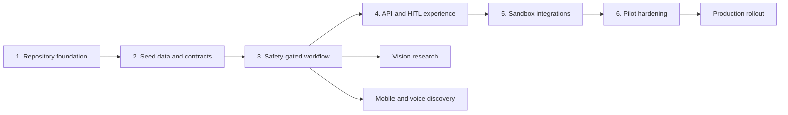

# SasyaAI Execution Roadmap

## 1. Critical path and parallel work

The critical path is Foundation -> Contracts -> Safety-gated workflow -> API/HITL -> Sandbox integration -> Pilot hardening. Vision research and mobile/voice discovery can run in parallel after the workflow contract is stable.

## 2. Milestone cards

### M0 - Repository foundation

**Objective:** establish a reproducible, reviewed codebase before live integrations.

| Field | Plan |
|---|---|
| Parent | Programme initiation |
| Dependencies | Approved product scope and synthetic-data policy |
| Outputs | Repository layout, local environment, CI checks, ownership docs |
| Complexity | Low |
| Effort | 2-3 engineer-days |
| Owner | Project lead + backend developer |
| Resources | Python, Docker, GitHub Actions, code-quality tools |
| AI tasks | Generate boilerplate, tests, documentation drafts |
| Manual tasks | Review security assumptions, select license, approve branch policy |

Child steps:

1. Create and review directory ownership and package boundaries.
2. Add environment template, ignore policy, formatting, test, and CI configuration.
3. Document development, contribution, testing, deployment, and release practices.

Validation checklist:

- [ ] Fresh clone can install dependencies and run lint/tests.
- [ ] Seed data is tracked while runtime/private data is ignored.
- [ ] CI fails on unit-test or lint failure.
- [ ] No credentials or real farmer records exist in committed files.

Common mistakes: treating a Docker file as a production deployment, ignoring runtime data without preserving seed fixtures, or allowing generated agent output to change safety rules without review.

### M1 - Synthetic data and typed contracts

**Objective:** make the demo repeatable and the future integrations replaceable.

| Field | Plan |
|---|---|
| Parent | M0 |
| Dependencies | M0 complete |
| Inputs | PRD, domain-reviewed example scenarios, source-data policy |
| Outputs | Farmer-twin schema, seed farmers, KB records, request/response models |
| Complexity | Medium |
| Effort | 4-5 engineer-days |
| Owner | Backend/data engineer + agricultural domain expert |
| Resources | Pydantic, JSON Schema, curated synthetic records |
| Parallel work | Crop/pest/scheme curation can proceed independently |

Child steps:

1. Define minimum twin fields, consent state, and data-provenance labels.
2. Create three synthetic personas for Maharashtra, Telangana, and Karnataka.
3. Curate crop, pest, and scheme examples with owner, source class, and expiry policy.
4. Add schema and seed-data validation.

Quality gates:

- [ ] Every farmer record has an explicit synthetic-data marker and consent state.
- [ ] Advice-relevant constraints are present: water, budget, crop, season, and eligible schemes.
- [ ] No seed record resembles a real identifiable farmer.
- [ ] Schemes are labelled as demo data until verified against a live authoritative source.

Common mistakes: using a real ID, missing units, mixing structured constraints into unvalidated narrative text, or treating a demo scheme record as a live eligibility decision.

### M2 - Safety-gated advisory workflow

**Objective:** demonstrate the core product safety contract end to end.

| Field | Plan |
|---|---|
| Parent | M1 |
| Dependencies | Typed inputs, seed twins, verifier rules |
| Outputs | Intent router, task trace, memory boundary, reflection, verifier, confidence route |
| Complexity | High |
| Effort | 7-10 engineer-days |
| Owner | AI architect + backend developer |
| Resources | FastAPI, deterministic rules, Lyzr/ADK evaluation plan |
| AI tasks | Prompt/design experiments and test-case generation |
| Manual tasks | Domain review of every hard constraint and escalation policy |

Child steps:

1. Implement crop-plan, diagnosis, and scheme task paths.
2. Restrict all persistence to the Memory Agent boundary.
3. Separate reflection quality checks from deterministic verification.
4. Enforce max-two replans, low-confidence threshold, and HITL queue creation.
5. Add regression tests for unsafe dosage, unavailable data, and failed verification.

Validation checklist:

- [ ] One crop-plan request returns evidence, explanation, trace, and verifier checks.
- [ ] A pesticide dose above the allowed maximum cannot auto-deliver.
- [ ] A confidence below 0.70 creates a review case.
- [ ] No direct specialist write reaches runtime state.
- [ ] Each tool failure yields fallback metadata or degraded confidence.

### M3 - Demo API and extension-officer experience

**Objective:** turn the workflow into a reviewable user-facing demonstration.

| Field | Plan |
|---|---|
| Parent | M2 |
| Dependencies | Verified response schema and HITL queue |
| Outputs | OpenAPI contract, basic dashboard, review decision flow, six-minute demo script |
| Complexity | Medium |
| Effort | 5-7 engineer-days |
| Owner | Full-stack developer + backend developer |
| Resources | React/Vite, accessible UI kit, FastAPI OpenAPI |
| Parallel work | UX prototype, API error handling, and demo rehearsal |

Child steps:

1. Show farmer context, recommendation, evidence, confidence, and verifier result.
2. Add approve, edit-and-approve, and reject actions with immutable reason capture.
3. Display demo limits and source freshness prominently.
4. Rehearse crop-plan and blocked-dose paths against a deployed endpoint.

Quality gates:

- [ ] Officer can understand why review is required without reading raw logs.
- [ ] UI never presents a pending or failed recommendation as approved advice.
- [ ] Keyboard navigation, contrast, and text scaling are usable.
- [ ] Demo takes under six minutes and the workflow completes under 20 seconds.

### M4 - AgriStack Sandbox and governed integrations

**Objective:** replace mocks safely, one bounded source at a time.

| Field | Plan |
|---|---|
| Parent | M3 |
| Dependencies | Consent model, adapter contract, error/fallback policy |
| Outputs | Sandbox adapters, provenance, token handling, contract tests |
| Complexity | High |
| Effort | 15-20 engineer-days |
| Owner | Backend/data engineer + security owner |
| Resources | AgriStack Sandbox, secrets manager, contract-test suite |
| Sequential work | Auth -> consent -> farmer/land/crop reads -> telemetry -> production application |

Child steps:

1. Authenticate with Network Manager/Token API using non-committed credentials.
2. Implement consent request, grant, state check, and revocation paths.
3. Add farmer, land, crop, aggregated-data, and telemetry adapters.
4. Enforce expiry, consent, mapping, and rate-limit behaviour in tests.
5. Build source-specific fallbacks and freshness indicators.

Validation checklist:

- [ ] All sandbox checklist items in `SANDBOX_USAGE.md` pass.
- [ ] Each retrieved fact carries source and timestamp.
- [ ] Revoked consent blocks future reads and queues required cleanup.
- [ ] Logs contain no raw credentials or sensitive payloads.

### M5 - Pilot hardening and production readiness

**Objective:** prepare a safe regional pilot before scale.

| Field | Plan |
|---|---|
| Parent | M4 |
| Dependencies | Sandbox exit, domain validation, service reliability baseline |
| Outputs | Persistent twin, Qdrant, model evaluation, monitoring, incident playbooks, pilot runbook |
| Complexity | Very high |
| Effort | 8-12 weeks |
| Owner | All roles; project lead accountable |
| Resources | PostgreSQL/PostGIS, Qdrant, observability, Indian-cloud account, pilot partners |
| Parallel work | Vision evaluation, geospatial ingest, mobile/voice, officer dashboard, reliability engineering |

Quality gates:

- [ ] Load, backup/restore, security, privacy, and failure-mode drills pass.
- [ ] Domain expert signs off on versioned safety rules and knowledge corpus.
- [ ] Vision confidence is calibrated on held-out regional data before any auto-delivery.
- [ ] SLOs, alerts, ownership, and on-call escalation are documented.
- [ ] Pilot consent, feedback, and redress paths are operational.

## 3. Detailed dependency backlog

| ID | Parent | Task | Owner | Effort | Depends on | Parallelism | Deliverable |
|---|---|---|---|---:|---|---|---|
| FND-01 | M0 | CI, lint, and unit-test gate | DevOps | 0.5d | Repository | Parallel | Green pull-request check |
| DAT-01 | M1 | Twin and response schemas | Backend | 1d | FND-01 | Sequential | Versioned Pydantic/JSON contracts |
| DAT-02 | M1 | Curate synthetic crop/pest/scheme records | Domain | 2d | DAT-01 | Parallel by corpus | Reviewed seed set |
| AGT-01 | M2 | Planner and specialist route contract | AI + backend | 2d | DAT-01 | Sequential | Typed task graph |
| AGT-02 | M2 | Memory ownership and retrieval adapter | Backend/data | 2d | DAT-01 | Parallel with AGT-01 | Retrieval and append interface |
| SAFE-01 | M2 | Rule catalogue and unit tests | Domain + backend | 2d | DAT-02 | Parallel with AGT-01 | Executable hard checks |
| HITL-01 | M3 | Officer review queue and decision audit | Full-stack + backend | 2d | SAFE-01 | Sequential | Approve/edit/reject flow |
| INT-01a | M3/M4 bridge | Fixture-only consent preflight and provenance contract | Backend + security | 1d | HITL-01 | Sequential | Fail-closed local contract tests; no live credentials or network |
| INT-01 | M4 | Consent adapter and revocation test | Backend + security | 3d | HITL-01 | Sequential | Sandbox consent evidence |
| INT-02 | M4 | Farmer, land, crop adapters | Backend/data | 5d | INT-01 | Parallel by API | Contract-tested adapters |
| MLOPS-01 | M5 | Vision data, evaluation, calibration | CV + domain | 4w | DAT-02 | Parallel with INT-02 | Model card and test report |
| OPS-01 | M5 | Observability, backups, incident drills | DevOps + security | 2w | INT-02 | Parallel with MLOPS-01 | Pilot runbook |

## 4. Milestone test checkpoints

| Checkpoint | Required tests |
|---|---|
| M0 | Lint, unit smoke test, secret scan |
| M1 | Schema validation, synthetic-data scan, retrieval relevance fixtures |
| M2 | Unit + integration, unsafe-output regression, fallback and HITL paths |
| M3 | API contract, browser E2E, accessibility, demo timing |
| M4 | Sandbox contract, consent revoke, rate limit, injected outage tests |
| M5 | Load, penetration, backup/restore, model evaluation, pilot acceptance |

## 5. Delivery cadence

- Daily: code review, test status, integration-risk check.
- Weekly: domain rule/knowledge review, architecture decision review, demo walkthrough.
- Before any pilot: privacy/security gate, source freshness review, human-review capacity check, rollback rehearsal.
