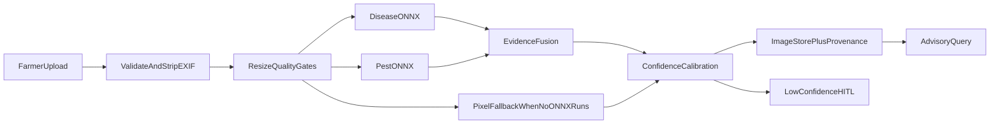

# Vision pipeline

Crop image upload runs **preprocess → disease + pest specialists → fuse → calibrate**.

| Backend | When used |
|---|---|
| **ONNX disease specialist** | `models/yolov8_npss/best.onnx` exists (`VISION_BACKEND=auto` or `onnx`) |
| **ONNX pest specialist** | `models/pest/best.onnx` exists (`VISION_BACKEND=auto` or `onnx`) |
| **Pixel vegetation CV** | Fallback when no installed ONNX specialist can run |

**Do not commit** `.pt` / `.onnx` to GitHub (100MB+). Keep them local / download via script.

See also: [ARCHITECTURE.md](ARCHITECTURE.md), [SasyaAI_PRD.md](SasyaAI_PRD.md) (FR-020).

---

## What exists today

| Layer | Status | Location |
|---|---|---|
| Upload API | Done | `POST /api/v1/farmers/{farmer_id}/images` |
| Preprocess | Done | EXIF strip, letterbox/resize, quality gates — [preprocess.py](../backend/app/services/vision/preprocess.py) |
| Pixel inference | Done | Vegetation / chlorosis / necrosis / speck metrics |
| **Dual ONNX YOLO detect** | Done | Model-declared input sizing, Ultralytics `(1, 4+nc, N)` decode + NMS — [onnx_backend.py](../backend/app/services/vision/onnx_backend.py) |
| Evidence fusion | Done | Preserves both specialist findings while keeping the public tuple contract |
| Labels | Done | Disease: 116 classes; pest: 102 classes |
| Calibration / HITL | Done | `VISION_HITL_THRESHOLD` |
| Provenance | Done | Per-specialist results in the stored `vision.specialists` block + advisory trace |
| Setup script | Done | [scripts/setup_vision.py](../scripts/setup_vision.py) |



Public contract unchanged: `(analysis_summary, suspected_issue, confidence)`.
Filename is never used for labels.

---

## Local model layout (gitignored binaries)

```text
models/yolov8_npss/
  PlantDiseaseDetection.pt   # source weights (~457 MB) — do not push
  best.onnx                  # exported detect graph (~218 MB) — do not push
  labels.yaml                # class names — safe to commit
  README.md

models/pest/
  best.pt                    # source weights — do not push
  best.onnx                  # exported detect graph — do not push
  labels.yaml                # 102 pest classes — safe to commit
```

Your project already has the `.pt` at `models/yolov8_npss/PlantDiseaseDetection.pt`.

### Convert + enable (Windows / local Python)

```powershell
cd C:\Users\Mukul Prasad\Desktop\PROJECTS\SasyaAI
pip install ultralytics onnx onnxruntime pyyaml pillow numpy
python scripts/setup_vision.py --pt models/yolov8_npss/PlantDiseaseDetection.pt
python scripts/setup_vision.py --model pest --pt models/pest/best.pt
```

Each command writes `labels.yaml` and `best.onnx` in its specialist folder.

In `.env`:

```env
VISION_BACKEND=auto
VISION_HITL_THRESHOLD=0.70
```

Restart API:

```powershell
# local
python -m uvicorn app.main:app --app-dir backend --reload

# or Docker (mount models so the container sees best.onnx)
docker compose up -d --build api
```

For Docker, either bake a private image with weights or bind-mount:

```yaml
# optional override — do not commit secrets/weights
services:
  api:
    volumes:
      - ./models:/app/models:ro
      - ./var:/app/var
```

### Why not push the model to GitHub?

| File | Size | GitHub |
|---|---|---|
| `PlantDiseaseDetection.pt` | ~457 MB | Rejected (100 MB hard limit) |
| Disease `best.onnx` | ~228 MB | Rejected / LFS pain for hackathons |
| Pest `best.onnx` | ~38 MB | Keep local with the other weight files |

`.gitignore` already ignores `*.pt` / `*.onnx` / most of `/models/**`, while allowing `labels.yaml` + folder README.

Reviewers without weights still run: pixel CV fallback is automatic when neither specialist can run. If only one model exists, `auto` runs that specialist.

---

## ONNX output contract

Installed export shapes:

- Disease: **`(1, 120, 8400)`**, input **640×640** (`4 + 116` class channels)
- Pest: **`(1, 106, 16464)`**, input **896×896** (`4 + 102` class channels)

- Post-process: transpose → score threshold → NMS → top label
- Prefers disease / damage labels over generic `* leaf` / `* healthy` when multiple boxes fire
- Reads each session's declared input size; the pest model is not forced into the disease model's 640×640 tensor

---

## Config

| Variable | Default | Meaning |
|---|---|---|
| `VISION_BACKEND` | `auto` | `auto` / `pixel` / `onnx` |
| `VISION_HITL_THRESHOLD` | `0.70` | Soft confidence floor |

---

## Tests

```powershell
python -m pytest tests/vision -q
```

Pixel fixtures always run. ONNX smoke tests skip only for missing optional specialist weights.

---

## Still future work

| Item | Notes |
|---|---|
| Pin Hugging Face `--hf-id` in `setup_vision.py` | Fill when you publish a stable repo revision for reviewers |
| Disease severity grading | Separate head |
| Dedicated vision microservice (:8002) | Optional scale-out |
| Gemini multimodal | Not required when ONNX is local |
| GPU / TensorRT | Optional speed-up |

---

## Changelog

| Date | Note |
|---|---|
| 2026-07-31 | Heuristic stub only. |
| 2026-08-03 | Preprocess + pixel CV + ONNX hook. |
| 2026-08-03 | Exported PlantDiseaseDetection → `best.onnx`; real YOLO decode/NMS; setup script. |
| 2026-08-16 | Added the 102-class pest specialist, dual-model fusion, per-model provenance, dashboard scan card, and independent fallback. |
