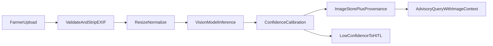

# Vision pipeline status and future build guide

> **Important:** The current hackathon build does **not** run real computer vision.
> Crop image upload works end-to-end, but analysis is a **deterministic heuristic stub**
> (filename keywords + file size). Treat all pest/disease labels as **demo signals only**
> until the vision pipeline below is implemented.

See also: [ARCHITECTURE.md](ARCHITECTURE.md) (planned `vision_agent`), [SasyaAI_PRD.md](SasyaAI_PRD.md) (FR-020, NPSS dataset), [SETUP_AND_DEPLOY.md](SETUP_AND_DEPLOY.md) (port 8002 sketch).

---

## What exists today (hackathon / demo)

| Layer | Status | Location |
|---|---|---|
| Upload API | Done | `POST /api/v1/farmers/{farmer_id}/images` in [backend/app/main.py](../backend/app/main.py) |
| RBAC | Done | Farmer / officer / admin with `require_farmer_assignment` |
| File validation | Done | JPEG, PNG, WebP; 5 MB max |
| Storage | Done | [FarmerImageStore](../backend/app/services/memory.py) — files under `var/.../images/`, metadata in `farmer_images.json` |
| **Analysis (NOT real CV)** | Stub | [AdvisoryService.analyse_crop_image](../backend/app/services/advisory.py) |
| Advisory attach | Done | `image_id` on [QueryRequest](../backend/app/models/advisory.py) → diagnosis context + `image_processor` trace step |
| Dashboard upload | Done | Advisory form file picker + Images tab in [frontend/src/App.tsx](../frontend/src/App.tsx) |
| Synthetic production | Done | [ProductionAdvisoryService](../backend/app/services/production.py) — upload + text summary injected into LLM prompt |
| Live production (`PRODUCTION_DATA_MODE=live`) | Not supported | Upload returns unavailable until live vision provider exists |

### Current stub behaviour (`analyse_crop_image`)

The stub does **not** decode pixels. It only:

1. Checks filename substrings (`aphid`, `pest`, `spot`, `blight`, `leaf`, …)
2. Uses payload byte length as a coarse `small` vs `detailed` hint
3. Returns a fixed `analysis_summary`, optional `suspected_issue`, and `confidence`

**Do not** use this for farmer-facing pest diagnosis in production without replacing it.

---

## What is NOT built (real CV pipeline)

These items are planned in the PRD and architecture docs but **not implemented** in this repository:

- Image decode, EXIF strip, resize/normalize, colour-space conversion
- NPSS / YOLOv8 (or equivalent) pest and disease detection
- Disease severity grading (e.g. EfficientNet-style classifier)
- Confidence calibration and HITL routing from vision scores
- Adversarial / anomaly input checks (`model_input_anomaly_score` in [SECURITY.md](SECURITY.md))
- Dedicated **vision agent** microservice (sketched at port 8002)
- Gemini multimodal / live vision API integration for production
- GPU inference deployment, batch preprocessing, model versioning

---

## Recommended future architecture



### Suggested implementation order

1. **Replace the stub** — swap `analyse_crop_image` for a module that calls a real model or vision service; keep the same return tuple `(summary, suspected_issue, confidence)` so API contracts stay stable.
2. **Add `backend/app/services/vision/`** — preprocessing (Pillow/opencv), inference wrapper, structured output schema.
3. **Model artifacts** — store under `/models/` (gitignored). Pin weights in docs or DVC; document download in this file when added.
4. **Tests** — `tests/vision/` with fixture images; assert label + confidence bands (see [SETUP_AND_DEPLOY.md](SETUP_AND_DEPLOY.md)).
5. **Production path** — either internal YOLO service or approved cloud vision; never silently fall back to filename heuristics in `PRODUCTION_DATA_MODE=live`.
6. **Observability** — log `model_version`, `inference_ms`, `input_hash`; expose in agent trace as real `image_processor` output.

### Contract to preserve

Upload response and stored record shape (from [FarmerImageStore.save](../backend/app/services/memory.py)):

- `image_id`, `farmer_id`, `filename`, `content_type`, `uploaded_at`
- `analysis_summary` (human-readable)
- `suspected_issue` (nullable label)
- `confidence` (0–1)

Query attachment: `QueryRequest.image_id` must reference a record owned by the same `farmer_id`.

---

## Local paths and gitignore

Heavy vision assets stay **out of git**. Relevant [.gitignore](../.gitignore) entries:

| Pattern | Purpose |
|---|---|
| `/models/` | YOLO / classifier weights |
| `*.pt`, `*.onnx`, `*.pth`, … | Model file extensions |
| `data/*` (except `data/seed/`) | Raw NPSS images, training sets |
| `checkpoints/`, `runs/`, `wandb/` | Training outputs |
| `var/` | Runtime uploads (`farmer_images.json`, stored JPEG/PNG) |

When you add real CV, document model download URLs and expected paths in the **Model artifacts** subsection below.

### Model artifacts (fill in when built)

```text
# Example — not present yet
models/yolov8_npss/best.pt
models/yolov8_npss/labels.yaml
data/raw/npss_images/          # optional local training cache
```

---

## Quick reference: files to touch for real CV

| File | Change |
|---|---|
| [backend/app/services/advisory.py](../backend/app/services/advisory.py) | Replace `analyse_crop_image` or delegate to vision service |
| [backend/app/services/production.py](../backend/app/services/production.py) | Same for production; add live provider when ready |
| [backend/app/main.py](../backend/app/main.py) | Optional async job endpoint for long inference |
| [frontend/src/App.tsx](../frontend/src/App.tsx) | Show real labels, confidence, “low confidence → officer review” |
| [Docs/API.md](API.md) | Document vision job status if added |
| [Docs/SECURITY.md](SECURITY.md) | Wire anomaly scoring when model exists |

---

## Changelog

| Date | Note |
|---|---|
| 2026-07-31 | Documented: upload pipeline live; analysis is heuristic stub only. Real CV deferred. |
